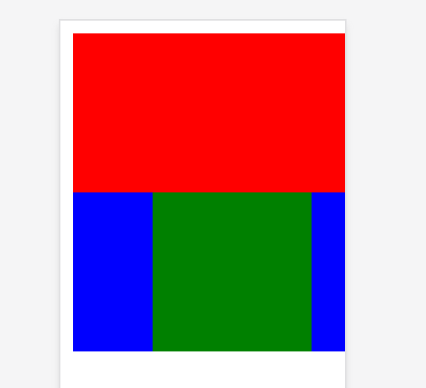

# Actually Semantic Styles

### The Problem
  We spent a lot of time iterating through various final project ideas, discarding old ones and immediately settling on new ones. We eventually realized that our ideation had two main themes -
something visual, and DSLs. So, we decided to look at markup languages, the most common form of visual DSLs. 
  
  The most common one of these is HTML. HTML was first created in the 90s, in order to give more structure and style to text. But HTML alone doesn't allow you to do much - HTML alone hardly has an advantage
over markdown. It's true expressiveness is only shown in conjunction with CSS. That's why it's surprising when you learn that HTML and CSS weren't ever designed to be written together.
  
  The great 90's vision of the web was so: webpage owners would populate their pages with content in the form of raw HTML, the content, and then visitors would apply their own styling to webpages. That way
each user could specify what they want their `h1`s, `il`s, etc to look like, and have a consistent visual experience throughout the entire web. 

  This system worked well enough for a couple years, yet slowly but surely, it started showing its superannuation. The advent of the corporate internet meant websites (brands) wanted to destinguish
themselves from their competitors, and make their sites more memorable. Even for the personal website, it was simply "cool" to have your own style. The HTML-CSS duality, although antiquated, continued
to persevere and became the dominant markup language due to it's ease of use. 

  Then the 2010's came along, and so did the era of the web-app. By now, the web was no longer primarly a source of information - it was instead an interface, primarly designed to be interactive.
Although the web being more accessible and understood was a good thing, it posed a serious problem for developers. The tools that the web has used for decades, the markup language, wasn't designed to be used
in this way, but rather, coerced and molded into something that worked. Web developers invented alternate frameworks that allowed to them to reason about content and styling as one single unit (because now,
content *was* styling), such as CSS-in-JS, Svelte, and Tailwind. But all of these had one huge, limiting factor - they still had to be compiled back into HTML and CSS, the languages that browsers knew
how to reason about.

  And it's not like the browsers were happy about this, either. The way CSS - *Cascading* Style Sheets - cascade down through every element, and the complex selectors available, hardly made styles easy to
reason about, even for a computer.

### The Solution
  For our 4110 final project, we decided to try to think of an alternative. We had a couple questions to address. If one were to design and implement a web markup language entirely from scratch,
what would it look like? Is it possible to make a language that's easier for both humans and computers to reason about? And most importantly, how does one more closely integrate style and content, and 
properly portray within the language's own grammar, that these two seemingly seperate constructs are often one and the same? And, how does one create a markup syntax that easily adapts to the wide variety
of screens and computers that browse the web today? Clearly, this was both a technical and design challenge.

  We quickly discovered what we wanted to be a part of our solution to the problem - constraint-based styling. Although an idea foreign to the web, constraint-based styling has been a tool in both Apple and
Google's mobile UI toolkit for a long time. Constraint based styling took a different, more flexible approach to specifying locations of elements.

  While in CSS you'd have to do some weird workaround such as `max-width: 600px; margins: 0 auto` to center an item (or, today, invoke flexbox), constraint-based styling takes a much more verbose approach -
one might simply write something like `el1[center] = window[center]`, and the element would be centered. Behind the scenes, this would emply some sort of constraint solving algorithm, such as Cassowary (this 
is an interesting parallel to where we've encountered constraints in the class - solving typing constraints, but they seem to be similar in name only).

  We also thought that it makes a lot more sense to let the programmer name everything, and let tag names be actually semantic, rather than the existing HTML specification, where HTML tag names kinda matter,
but kinda don't.

So, we took those ideas, as well as some inspiration from popular UI frameworks such as Svelte and Tailwind, and came up with a syntax.

Think of this HTML, which centeres a box in the screen, puts a smaller rectangle at it's top, and a box inside of that recangle.

```html

<html>
  <body>
    <style>
      #outer {
        width: 200px;
        height: 200px;
        background-color: red;
        margin: 0 auto;
      }

      #inner {
        position: relative;
        bottom: -100px;
        width: 200px;
        height: 50%;
        background-color: blue;
      }

      #innerst {
        width: 100px;
        height: 100%;
        margin: 0 auto;
        background-color: green;
      }
    </style>
    <div id="outer">
      <div id="inner">
        <div id="innerst">
        </div>
      </div>
    </div>
  </body>
</html>
```

That's an awful lot of boilerplate for such a simple image:


Now, any web development veteran would immediately tell you the issue with the above code: **it's not responsive**. If someone were to come along with a smaller screen than the boxes, it would
break and scroll weird:



Here's a possible way to avoid that, while still retaining the margins:

```html
<html>
  <body>
    <style>
      #outer {
        max-width: calc(100vw - 16px);
        width: 200px;
        max-height: calc(100vw - 16px);
        height: 200px;
        background-color: red;
        margin: 0 auto;
      }

      #inner {
        position: relative;
        bottom: -50%;
        width: 100%;
        height: 50%;
        background-color: blue;
      }

      #innerst {
        width: 50%;
        height: 100%;
        margin: 0 auto;
        background-color: green;
      }
    </style>
    <div id="outer">
      <div id="inner">
        <div id="innerst">
        </div>
      </div>
    </div>
  </body>
</html>
```

That's getting to be way too much code for such a simple task. And it's entirely unintuitive! If I hadn't used this trick before, and hadn't found it on StackOverflow originally, I'd never know what to do.

Is there a better alternative, you ask? Of course.

```html
<style>
  outer {
    width = 200px, else = $window[width] - 10px
    height = width
    color = red
    hcenter = $window[hcenter]
  }

  inner {
    bottom = $parent[bottom]
    top = $parent[hcenter]
    width = $parent[width]
    color = blue
  }

  innerst {
    width = $parent[width] / 2
    height = $parent[height]
    hcenter = $parent[hcenter]
    color = green
  }
</style>
<outer>
  <inner>
    <innerst>
    </innerst>
  </inner>
</outer>
```

Isn't that *so much less code*? And it makes so much more intuitive sense, too!  The first rule sets the width to be 200 pixels, but if that can't happen due to window size or other limitations, it sets the
size to be the window height minus 10 pixels, for margin. And then it just locks the height to the width, to maintain the cube shape. Easy! And the actual content tree is so much easier to understand, too!
Unnecessary, unsemantic `div` statements begone!

### The implementation

Our eventual goal is to be able to take something like the specification above, and transform it into an image with a rudimentary browser. For this reason, we've picked Rust as our implementation language.
Its diverse ecosystem means we're not going to write extra code, multiple browsers that we can use as reference points have been written the language already, and most importantly, it is an absolute
pleasure to work with.

So far, we've implemented the parsers for the tree and styling languages using the rust library `rust-peg`. As its name suggests, it is a parser package based off of the PEG specification language.

Right now, the tree parser would take as an input something like `<element><another></element></element>` and return a tree data structure:
```rust
Tag {
    traits: [
        Trait {
            name: "element",
            args: [],
        },
    ],
    children: [
        Tag {
            traits: [
                Trait {
                    name: "another",
                    args: [],
                },
            ],
            children: [],
        },
    ],
},
```

(if you want to know about args and other details, check out [the specification](https://github.com/ashpil/ASS/documents/specification.md)).

Similar for the styles, `tag { width = 50, else = 30\n height <= $parent[width] }` parses to this:
```rust
Style {
    name: "tag",
    attr: {
        "width": [
            (
                EQ,
                Num(
                    50,
                ),
            ),
            (
                EQ,
                Num(
                    30,
                ),
            ),
        ],
        "height": [
            (
                LE,
                Ref(
                    Parent,
                    "width",
                ),
            ),
        ],
    },
},
```

The PEG syntax seemed alien at first, but the documentation is great, and once you get the hang of it, it makes a lot of sense and is really expressive. The one issue is that whitespace and comments can
get a little verbose.

### The future

Now that we can get data from text files, our next goal is to actually get some sort of picture from that data. Rust has an
[existing Cassowary solver implementation](https://docs.rs/cassowary/0.3.0/cassowary/) that we intend to use, as well as similar simple browser implementations, ex.
[Kosmonaut](https://github.com/twilco/kosmonaut) that we can base our code off of.

All in all, this is shaping up to be a very fun project! It's interesting to design a programming language that doesn't get interpreted into some final text value, but rather, something visual.

