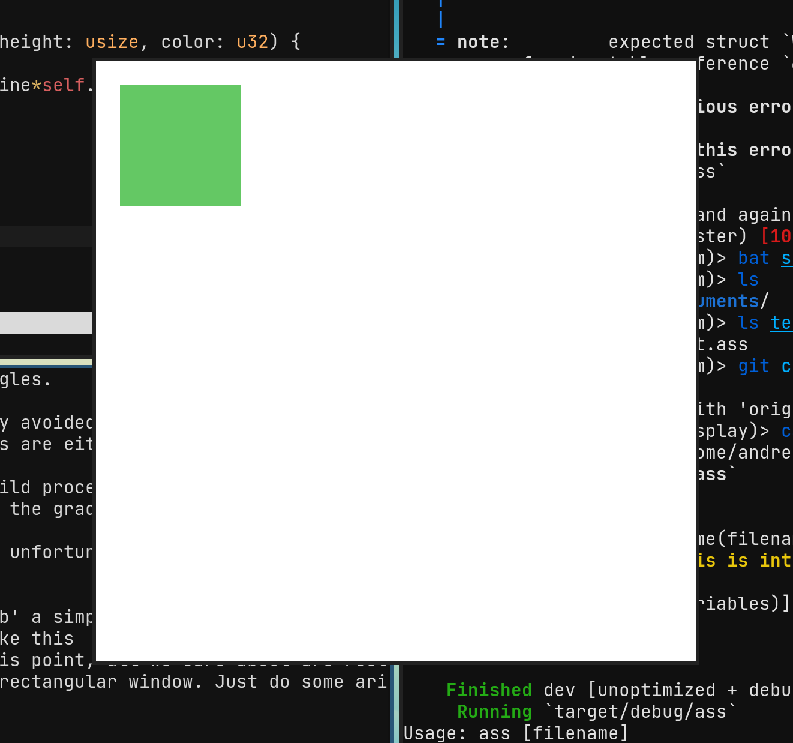

## Introduction 

The beta phase posed very different challenges than the alpha.

Our alpha was concerned with designing and parsing the syntax of the language, whereas in beta it was all the nitty-gritty rendering and displaying.

This consisted of two main challenges. The first was creating a render tree - the browser equivalent of an abstract syntax tree - and the second was actually rendering that tree to a window.

## Windowing and displaying

Turns out, this is one of Rust's weaknesses. Although actually making a window is super simple, displaying anything on it is a hassle. Rust has a gap exactly where we'd like to be - Rust has a decent amount
of mature-ish GUI Toolkits, a decent 3D graphics ecosystem, and tons of low level stuff - but our ideal was an abstraction that just let us draw 2D shapes to a window, an area that was largely uncontested. 

Initially we had thought of going with the direct OpenGL route, which seemed to be rather popular, and is how previous browser engines we have based ours off of have done their displaying.
The problem with that is that OpenGL sucks, and is rather overkill for what we're trying to do, which at this point is just displaying rectangles. 

Rust is a very new language, and it's contributers have rightfully avoided making old structures such as OpenGL a significant part of the ecosystem. Existing solutions are either very poorly documented, or
rely on pulling in a non-Rust dependency, which would make our build process more complicated and and decrease our cross-platoform compability (who knows what systems the graders are running!). Instead of 
OpenGL, the rust community has embraced Vulkan and WebGPU, which, unfortunately, are even less documented despite being super cool. 

Thinking such solutions overkill, we eventually arrived at [`minifb`](https://github.com/emoon/rust_minifb) a simple window abstraction that allowed direct writing to a pixel framebuffer.
While something like this would make 3D graphics or even complex 2D shapes difficult, at this point, all we care about are rectangles, and it's super easy to make a subrectangle in an already rectangular
window from scratch. Just do some modular arithmetic, and set certain bytes to be specific colors in a framebuffer.

Doing so, we arrive at a simple window which is cross-platform and gives us control over resizing, which is essential for demonstrating constraint-based layouts on different screens.

## Building the render tree

## Conclusion

All in all we're rather satisfied with this milestone. Looking back, our predictions of the challenges we faced were very wrong. Getting an image alone posed a challenge, and so did constructing a sane
render tree.
